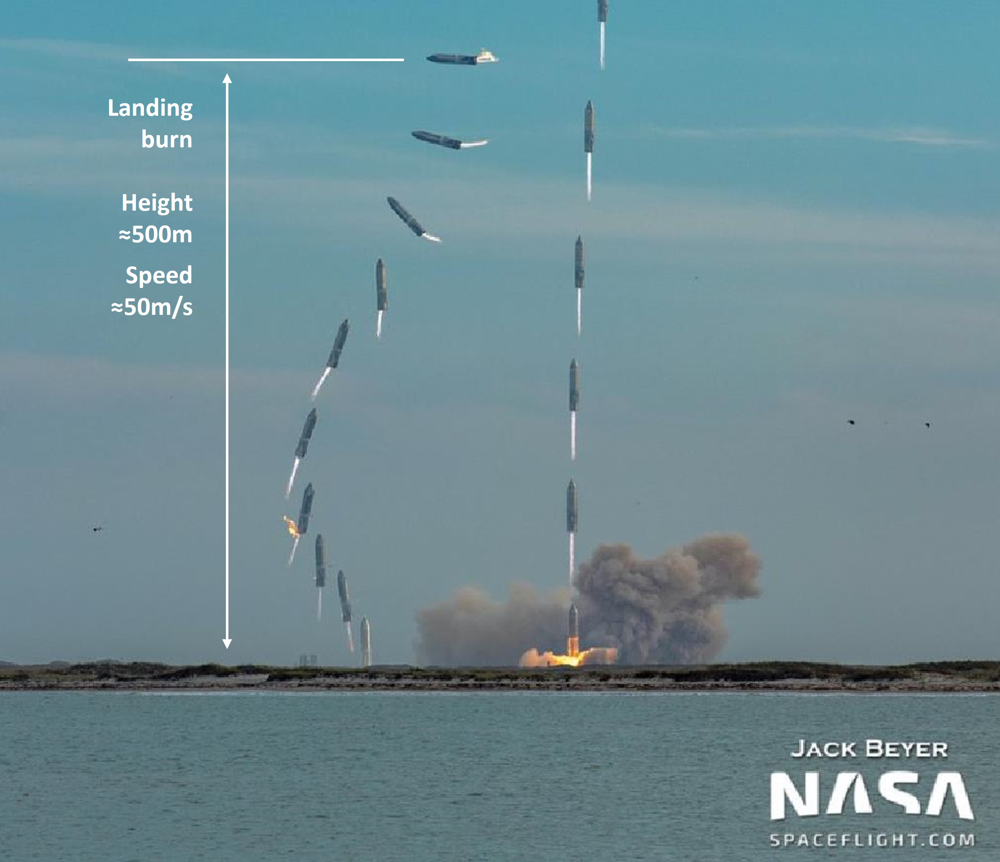

# Rocket-recycling with Reinforcement Learning based recycling game

Developed by: [Leo Liu](https://github.com/githubLeoliu)


## About this project

This project is based on a rocket recycling with reinforcement learning developed by  Zhengxia Zou, Ph.D.

I was inspired by his AI approach of recycling rocket. By modifying his project, users can try recycling the rocket as it is a game. 

Feel free to try if you think you can beat the artificial intelligent algorithm. 


For the landing task, I followed the basic parameters of the Starship SN10 belly flop maneuver. The initial speed is set to -50m/s. The rocket orientation is set to 90 degrees (horizontally). The landing burn height is set to 500 meters above the ground. 



Image credit https://twitter.com/thejackbeyer/status/1367364251233497095

## Requirements

See [Requirements.txt](Requirements.txt).


## Usage

To play the game './game'


## Citation

``````
@misc{zou2021rocket,
  author = {Zhengxia Zou},
  title = {Rocket-recycling with Reinforcement Learning},
  year = {2021},
  publisher = {GitHub},
  journal = {GitHub repository},
  howpublished = {\url{https://github.com/jiupinjia/rocket-recycling}}
}
``````